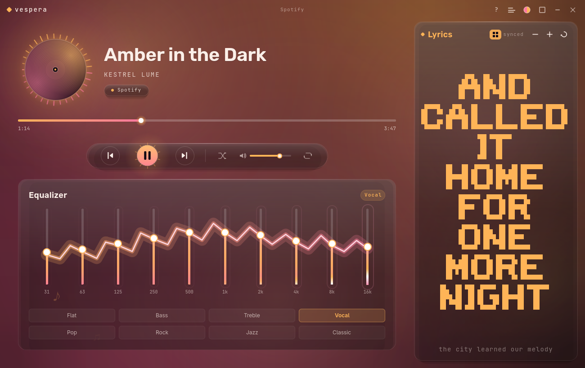
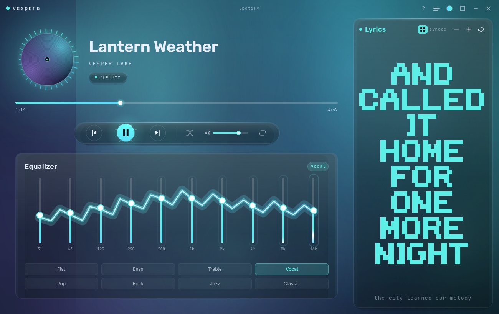
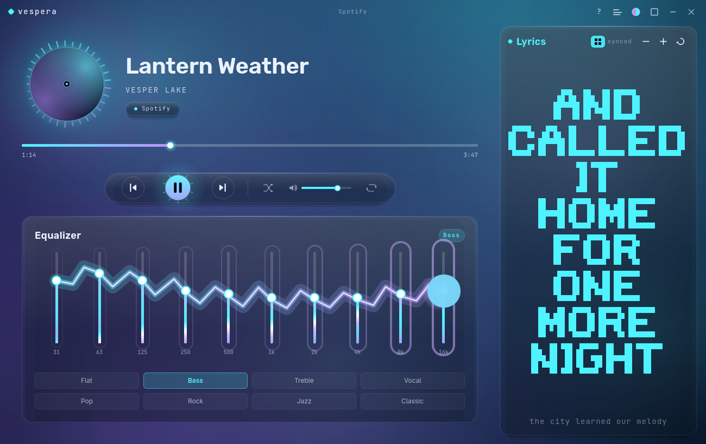
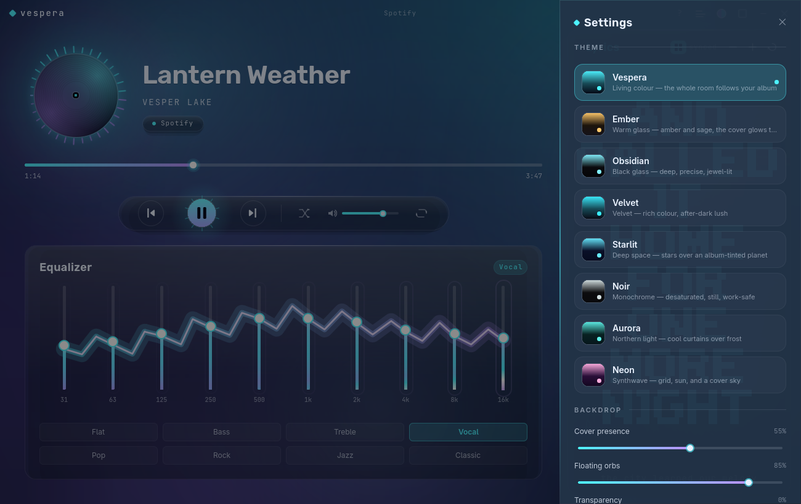

<div align="center">


# Vespera

### The music companion that paints your desktop with your music.

Vespera rides along with whatever you're already playing — Spotify, a browser, any
MPRIS source — and turns it into something beautiful: **synced lyrics**, a **living
album-coloured interface**, a **10-band equalizer**, and glassy, deeply customizable
visuals. No streaming, no accounts, no telemetry. Just a gorgeous window over the
music you already have.

[](https://github.com/hamza-abdelmoumene/vespera/actions/workflows/ci.yml)
[](https://github.com/hamza-abdelmoumene/vespera/releases)
[](LICENSE)
-333)



</div>

---

Vespera is a **controller, not a player**. It doesn't stream or decode audio — it
drives whatever is already playing on your system and wraps it in a premium,
themeable interface. It has **zero desktop-environment coupling** by design: no
dependency on any shell, compositor, or dotfiles, so it installs and runs for a
stranger on Fedora GNOME just as well as on Arch with a tiling WM.

## ✦ Highlights

- **🎨 Dynamic theming that actually follows your music.** The flagship *Vespera*
  theme extracts a palette from each cover (in-process, OKLCh-normalised) and
  recolours the **entire** room — backdrop, glass, orbs, equalizer, lyrics — with a
  smooth cross-fade on every track. Prefer a fixed mood? Ship-in themes include
  Ember, Obsidian, Velvet, Starlit, Noir, Aurora and Neon.
- **🅰 Lyrics, your way.** A scrolling synced list you can click to seek — **or** big
  **ASCII block-letter** karaoke, the way terminal ricers love it. One tap to switch,
  or hide the pane entirely and go full-width.
- **🎚 A real 10-band equalizer** applied live through EasyEffects, with presets and a
  smooth **lightning-sweep** transition that ripples across the bands on every change.
- **🫧 A living backdrop.** A softly-blurred album field with slow **floating orbs**
  and adjustable **transparency**, so it melts into your compositor's blur.
- **🛠 Deeply customizable.** A structured Settings drawer puts *everything* on a live
  slider — cover presence, orbs, transparency, glass frost & blur, glow, accent
  shift, motion, vignette, typography, and more — plus a first-run **tutorial** and a
  `?` help panel any time.
- **⌨ Built for keyboards & tiling WMs.** Single-instance D-Bus control so any window
  manager can bind play/pause, next, toggle, and more.
- **🔒 No telemetry. No accounts. No DRM. Unprivileged.**

> **How this was built** — Vespera was written collaboratively with an AI coding
> assistant; it is, honestly, *"vibe-coded."* It builds reproducibly in CI, contains
> no telemetry, talks only to the session bus and public lyric APIs over HTTPS, and
> needs no elevated privileges. Read the source before use in sensitive contexts —
> see [SECURITY.md](SECURITY.md).

## Screenshots

<div align="center">

**Every track repaints the room** — the same app, two different albums:

 

**Equalizer with the lightning sweep** · **Deep, organized Settings**

 

**Compact mini-player**


</div>

## Install

### 🚀 Quick install (any distro, one line)

Builds and installs into `~/.local` — no root, no clone. **Review scripts before
piping them to a shell** (see [SECURITY.md](SECURITY.md)):

```sh
curl -fsSL https://raw.githubusercontent.com/hamza-abdelmoumene/vespera/main/install.sh | bash -s -- --user
```

### 📦 AppImage (portable, nothing to install)

Grab the latest `.AppImage` from the
[releases page](https://github.com/hamza-abdelmoumene/vespera/releases):

```sh
chmod +x vespera-*-x86_64.AppImage
./vespera-*-x86_64.AppImage
```

### 🐧 Arch Linux (AUR)

```sh
yay -S vespera        # latest release
yay -S vespera-git    # build from main
```

### 🔧 From a clone

```sh
git clone https://github.com/hamza-abdelmoumene/vespera && cd vespera
./install.sh --user     # -> ~/.local  (no root)
./install.sh            # -> /usr/local (uses sudo)
```

The installer auto-detects and installs Qt build dependencies on Arch, Debian/Ubuntu
and Fedora, then builds and installs the binary, desktop entry and icon.

### 📦 Flatpak

A manifest lives in
[`packaging/flatpak`](packaging/flatpak/io.github.hamza_abdelmoumene.vespera.yml).
(The cava visualizer and EasyEffects equalizer are host tools and aren't available
inside the sandbox — use the AppImage or a native install for those.)

## Usage

```sh
vespera                 # launch, or raise the running instance
vespera --compact       # compact mini layout
vespera doctor          # report detected players and optional features
vespera --version

# control a running instance — bind these to your WM keys:
vespera toggle          # show / hide the window
vespera play-pause
vespera next
vespera prev
```

**In the window:** `Space` play/pause · `←`/`→` seek · `N`/`P` next/prev · `?` help ·
click a lyric to seek · toggle block-letter lyrics from the Lyrics header · open
**Settings** (◈, top-right) to customize everything.

**Example Hyprland binds:**

```ini
bind = SUPER SHIFT, M, exec, vespera toggle
bind = , XF86AudioPlay, exec, vespera play-pause
```

## Optional dependencies

Vespera works out of the box; these unlock extra features when present and hide
gracefully when not. Run `vespera doctor` to see what's detected.

| Tool | Unlocks |
|---|---|
| [`cava`](https://github.com/karlstav/cava) | audio-reactive spectrum on the disc |
| [`easyeffects`](https://github.com/wwmm/easyeffects) | the live 10-band equalizer |

## Configuration

Everything lives under XDG paths — nothing user-specific is hardcoded:

- `~/.config/vespera/` — window geometry, theme + all customization knobs, cava/EQ state
- `~/.local/share/vespera/` — per-track lyric offsets
- `~/.config/vespera/themes/*.json` — drop in your own themes (hot-reloaded)

Every look setting is also a live control in the in-app **Settings** drawer.

## Building from source

Requires **Qt 6.5+** (Core, Gui, Qml, Quick, QuickControls2, DBus, Network),
CMake 3.21+, and a C++20 compiler.

```sh
cmake -S . -B build -G Ninja -DCMAKE_BUILD_TYPE=Release
cmake --build build
./build/vespera
```

```sh
# Arch
sudo pacman -S --needed base-devel cmake ninja qt6-base qt6-declarative
# Debian / Ubuntu
sudo apt install build-essential cmake ninja-build qt6-base-dev qt6-declarative-dev
# Fedora
sudo dnf install gcc-c++ cmake ninja-build qt6-qtbase-devel qt6-qtdeclarative-devel
```

## How it works

| Layer | What it does |
|---|---|
| **MPRIS core** (C++) | ranked active-player selection, metadata, transport, volume/shuffle/repeat, single-instance D-Bus control |
| **Palette engine** (C++) | in-process OKLCh cover-art quantisation → album accent/base/text, cross-faded per track |
| **Theme engine** (C++) | declarative themes (`struct` + JSON, hot-reloaded) interpreting the album palette; all customization knobs |
| **QML front-end** | glass panels (real backdrop blur), orb backdrop, disc, equalizer, lyrics, settings & tutorial |

## Contributing

Contributions welcome — see [CONTRIBUTING.md](CONTRIBUTING.md) and the
[Code of Conduct](CODE_OF_CONDUCT.md). Issues and ideas go through the
[issue tracker](https://github.com/hamza-abdelmoumene/vespera/issues).

## Acknowledgements

Lyrics via [lrclib](https://lrclib.net); spectrum via
[cava](https://github.com/karlstav/cava); equalizer via
[EasyEffects](https://github.com/wwmm/easyeffects). The block-letter lyrics and
equalizer feel follow the author's personal Quickshell player.

## License

MIT © Hamza Abdelmoumene. See [LICENSE](LICENSE).
