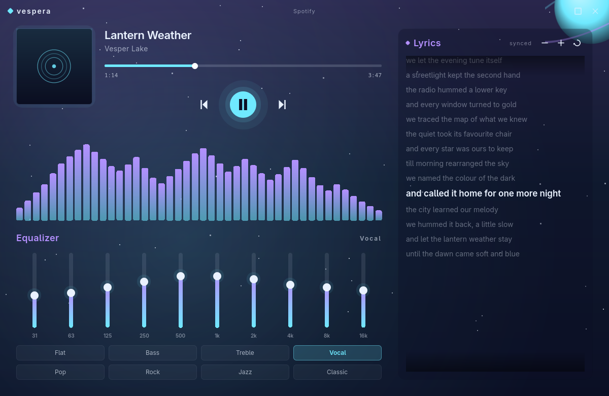
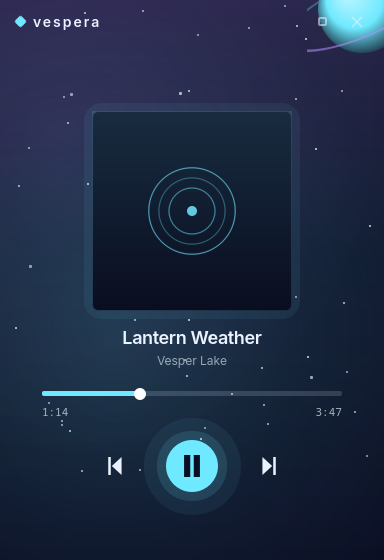

<div align="center">


# Vespera

**A standalone, distro-agnostic music player companion for Linux.**

MPRIS control · synced lyrics · audio visualizer · 10-band equalizer · album-tinted theming

[](https://github.com/hamza-abdelmoumene/vespera/actions/workflows/ci.yml)
[](https://github.com/hamza-abdelmoumene/vespera/releases)
[](LICENSE)
-333)



</div>

---

Vespera is a **controller, not a player**. It doesn't stream or decode audio; it
drives whatever is already playing on your system (Spotify, mpv, browsers, any
MPRIS source) and wraps it in a premium, calm, themeable interface — synced
lyrics, an audio visualizer, a real equalizer, and an animated starry backdrop
tinted from the album art.

It has **zero desktop-environment coupling** by design: no dependency on any
particular shell, compositor, or dotfiles. It is built to install and run for a
stranger on Fedora GNOME just as well as on Arch with a tiling WM.

> ### A note on how this was built
> Vespera was written collaboratively with an AI coding assistant — it is, in the
> honest sense, **"vibe-coded."** The code is reviewed, builds reproducibly in CI,
> contains no telemetry, and is MIT-licensed. It is a controller that talks to the
> session bus and reads public lyrics over HTTPS; it does not require elevated
> privileges. Read the source before use in security-sensitive contexts, and see
> [SECURITY.md](SECURITY.md).

## Features

- **MPRIS control** over the session bus: play/pause, next/previous, seek, live
  position and metadata, with ranked active-player selection that de-prioritises
  browser tabs.
- **Synced lyrics** via [lrclib](https://lrclib.net) (with a NetEase fallback):
  auto-scrolling, click any line to seek, per-track timing offset, and resync.
- **Audio visualizer** powered by [cava](https://github.com/karlstav/cava) — an
  album-tinted bar spectrum (optional; hides cleanly if cava is absent).
- **10-band equalizer** applied live through
  [EasyEffects](https://github.com/wwmm/easyeffects), with presets
  (Flat / Bass / Treble / Vocal / Pop / Rock / Jazz / Classic) and a lightning
  sweep on preset changes (optional; hides cleanly if EasyEffects is absent).
- **Album-derived theming**: accent colours are extracted from the cover art in
  process (OKLCh-normalised, no ImageMagick) and drive the whole UI, which
  cross-fades smoothly to each track's palette.
- **Responsive layout**: player and lyrics panes on wide windows, a compact
  now-playing card on narrow ones.
- **Single-instance D-Bus control** so any window manager can bind keys to it.
- **No telemetry. No accounts. No DRM.**

## Screenshots

| Expanded (player · visualizer · equalizer · lyrics) | Compact |
|---|---|
|  |  |

## Install

### AppImage (any distro, no install)

Download the latest `.AppImage` from the
[releases page](https://github.com/hamza-abdelmoumene/vespera/releases), then:

```sh
chmod +x vespera-*-x86_64.AppImage
./vespera-*-x86_64.AppImage
```

### Arch Linux (AUR)

```sh
yay -S vespera        # latest release
yay -S vespera-git    # build from the main branch
```

### From source (one command)

Builds and installs from a clone, or fetches the source itself if run standalone:

```sh
# inside a clone:
./install.sh              # installs to /usr/local (uses sudo)
./install.sh --user       # installs to ~/.local (no root)

# standalone (review it first — see SECURITY.md):
curl -fsSL https://raw.githubusercontent.com/hamza-abdelmoumene/vespera/main/install.sh | bash
```

### Flatpak

A manifest is provided at
[`packaging/flatpak`](packaging/flatpak/io.github.hamza_abdelmoumene.vespera.yml).
Build it locally with `flatpak-builder`. (The cava visualizer and EasyEffects
equalizer are host tools and are unavailable inside the Flatpak sandbox; use the
AppImage or a native install for those.)

## Usage

```sh
vespera                 # launch, or raise the running instance
vespera --compact       # compact mini layout
vespera doctor          # report detected players and optional features
vespera --version

# control a running instance — bind these to your WM keys:
vespera toggle          # show / hide the window
vespera play-pause
vespera next
vespera prev
```

**In the window:** `space` play/pause · `←`/`→` seek 5s · `n`/`p` next/prev ·
click a lyric line to seek · `−`/`+` nudge the lyric offset · click an EQ preset.

**Example Hyprland keybinds:**

```ini
bind = SUPER SHIFT, M, exec, vespera toggle
bind = , XF86AudioPlay, exec, vespera play-pause
```

## Optional dependencies

Vespera works out of the box; these unlock extra features when present and are
hidden gracefully when not. Run `vespera doctor` to see what's detected.

| Tool | Unlocks |
|---|---|
| [`cava`](https://github.com/karlstav/cava) | audio visualizer |
| [`easyeffects`](https://github.com/wwmm/easyeffects) | 10-band equalizer |

## Configuration

Everything lives under XDG paths — no user-specific paths are hardcoded:

- `~/.config/vespera/` — window geometry, generated cava config, EQ state
- `~/.local/share/vespera/` — per-track lyric offsets

## Building from source

Requires **Qt 6.5+** (Core, Gui, Qml, Quick, QuickControls2, DBus, Network),
CMake 3.21+, and a C++20 compiler.

```sh
cmake -S . -B build -G Ninja -DCMAKE_BUILD_TYPE=Release
cmake --build build
./build/vespera
```

Per-distro build dependencies:

```sh
# Arch
sudo pacman -S --needed base-devel cmake ninja qt6-base qt6-declarative
# Debian / Ubuntu
sudo apt install build-essential cmake ninja-build qt6-base-dev qt6-declarative-dev
# Fedora
sudo dnf install gcc-c++ cmake ninja-build qt6-qtbase-devel qt6-qtdeclarative-devel
```

## Roadmap

| Milestone | State |
|---|---|
| Core player (MPRIS, palette, single-instance IPC, compact) | done |
| Responsive layout (player \| lyrics two-pane) | done |
| Lyrics · visualizer · equalizer | done |
| Theme engine (declarative themes + scenes + dynamic colour sources) | planned |
| Plugin system | planned |
| Wider packaging (Flathub, deb/rpm) | planned |

## Contributing

Contributions are welcome — see [CONTRIBUTING.md](CONTRIBUTING.md) and the
[Code of Conduct](CODE_OF_CONDUCT.md). Bug reports and feature requests go through
the [issue tracker](https://github.com/hamza-abdelmoumene/vespera/issues).

## Security

Vespera runs unprivileged, uses only the session bus and HTTPS lyric lookups, and
collects nothing. To report a vulnerability, see [SECURITY.md](SECURITY.md).

## Acknowledgements

The visualizer, equalizer and lyrics design follow the author's personal
Quickshell player; lyrics use [lrclib](https://lrclib.net); the visualizer is
[cava](https://github.com/karlstav/cava); the equalizer drives
[EasyEffects](https://github.com/wwmm/easyeffects).

## License

MIT © Hamza Abdelmoumene. See [LICENSE](LICENSE).
